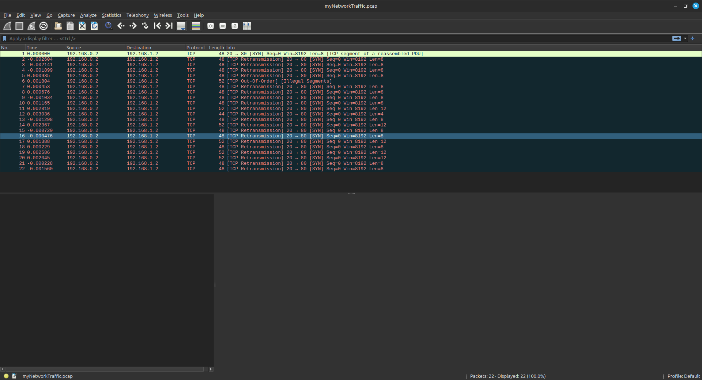
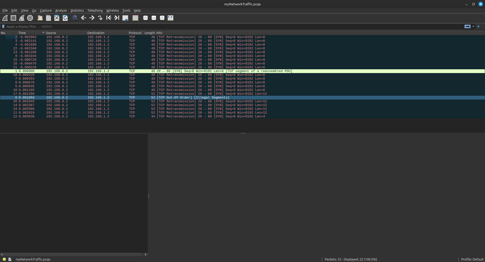
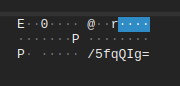
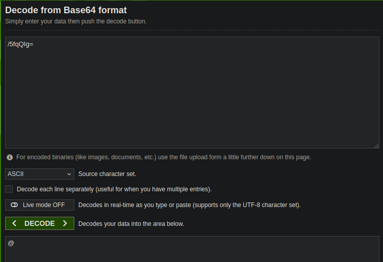
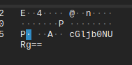
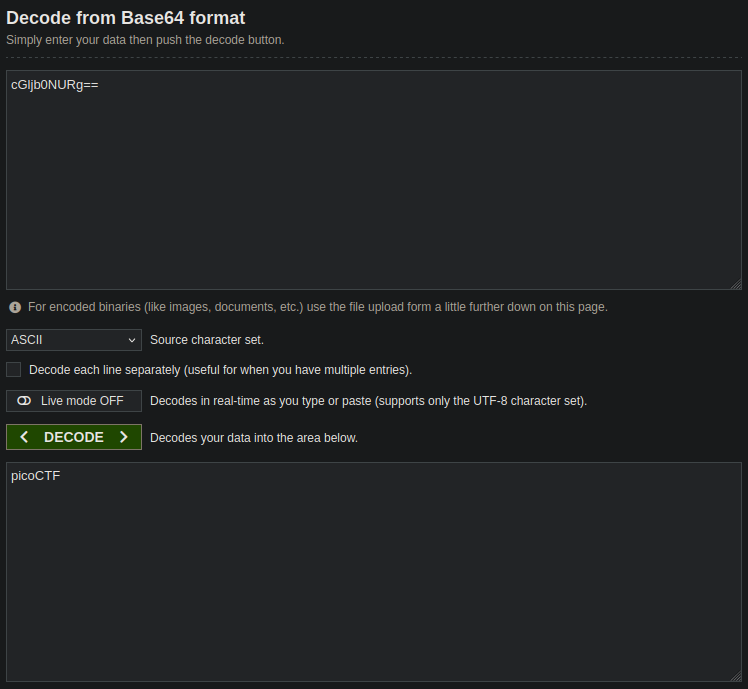

### Challenge: Ph4nt0m_1ntrud3r
### Difficulty: Easy
#### Author: deathwish24

The author of this challenge provides a packet capture file and it we need to analyze it in order to find the flag.

After downloading the file, we need to open it with Wireshark. 

You can do it by running the following on your terminal:

```console
wireshark myNetworkTraffic.pcap
```

And will open a window looking like this:

<p align="center">

</p>

Now as we can see on the `Time` column, the packages aren't sorted in an ascending order. In order to do it we need to click on it and it will sort them as we want. 

After sorting the packages, it should look like this:

<p align="center">

</p>

Now we can start looking at each package and find the sent data each time. The data are sent [Base64](https://en.wikipedia.org/wiki/Base64) encoded and look like this:

<p align="center">

</p>

In order to understand what these data mean we will use the [Base64 Decoder](https://www.base64decode.org/).

For example if we paste the data from the image above in the decoder and we get this:


<p align="center">

</p>

As we can see this doesnt make much sense.

So we will try the next package's data and so on.

Reaching the last 7 packages, we notice that they have 2 `=` (equal sign) in the end and also that their `Length` is 52 bytes. So this means, that we have more info and possibly parts of the flag we are searching for.

For example the package with `No.` 17, has the following data:

<p align="center">

</p>

And after decoding this Base64 string, we realize that its the beginning of our flag:

<p align="center">

</p>

Repeating this process with the rest packages will give us the entire flag!
