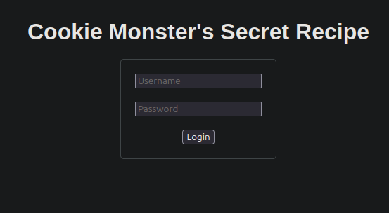
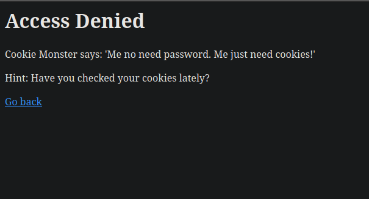
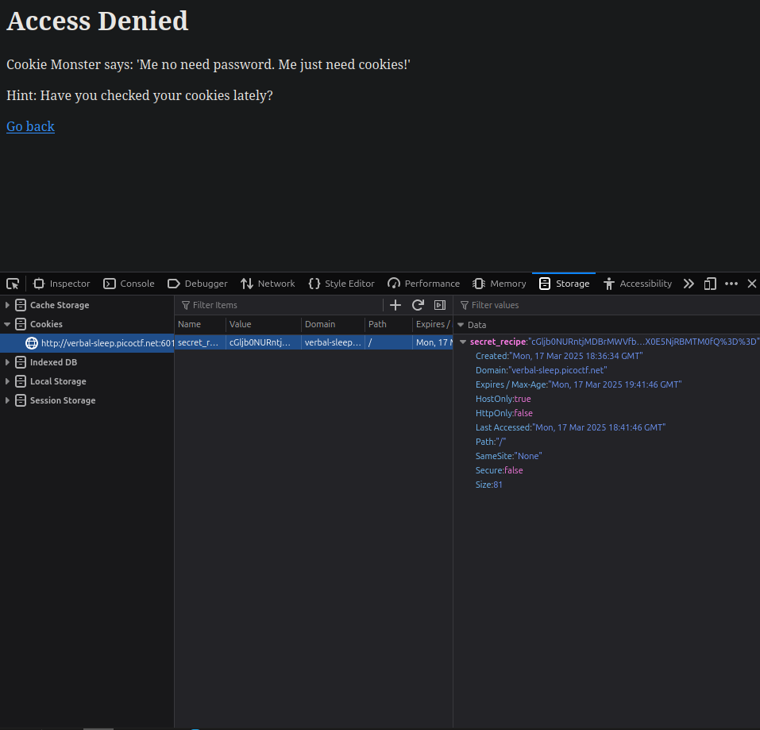
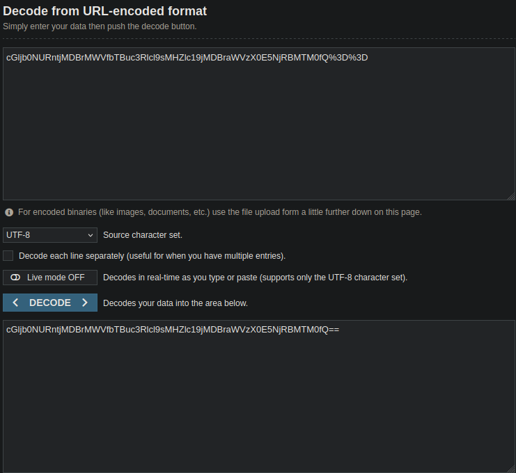
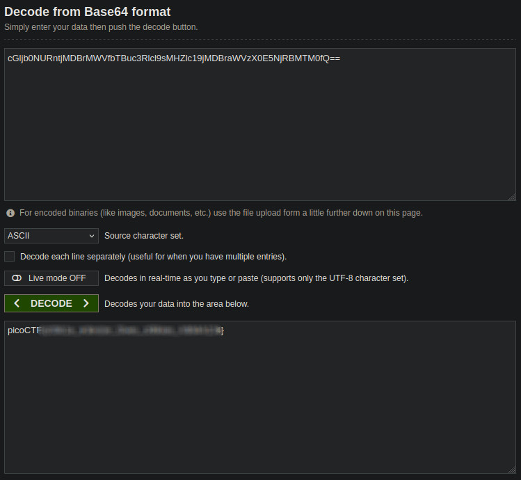

### Challenge: Cookie Monster Secret Recipe
### Difficulty: Easy
#### Prepared by: deathwish24

The author of this challenge asks us if we can `outsmart Cookie Monster and find the hidden recipe?`.

Directly what comes to mind is to find a cookie in the website. Let's jump in the website and find out what this is all about.

Looking at the site we can see a simple login form:

We can use whatever credentials we want to login but I will use for both username and password the word `guest`.

As we can see the access to the website is denied:

So now lets open the DevTools of our browser and check under the `Storage` (Mozilla) or `Application` (Chrome - Chromium) tab for a cookie.

We found a long string that seems to be URL encoded. We can identify it is URL encoded if we look at the end and we will see that it has `%3D` (which represents the `=` character in URL encoding). To find out more about URL encoding patterns check [W3Schools HTML Encoding Reference](https://www.w3schools.com/tags/ref_urlencode.ASP).

Now to decode it we will use a [URL Decoder](https://www.urldecoder.org/), to find out what it really contains.

Decoding it revealed a Base64 string, which we need to also decode using [Base64 Decoder](https://www.base64decode.org/).

And that was it. We found another flag!
