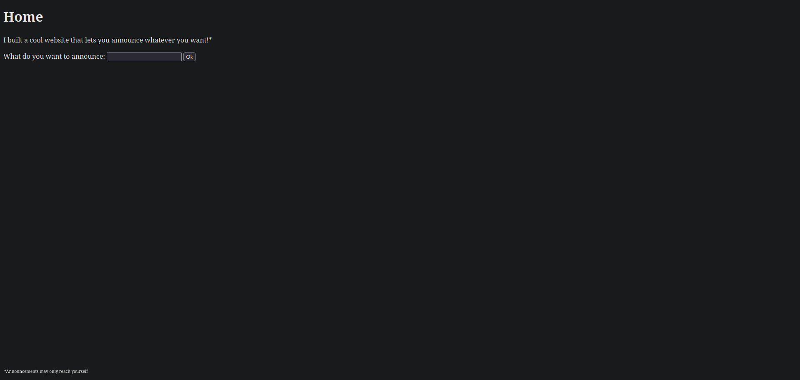
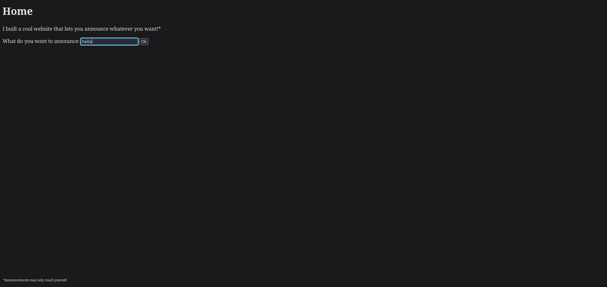
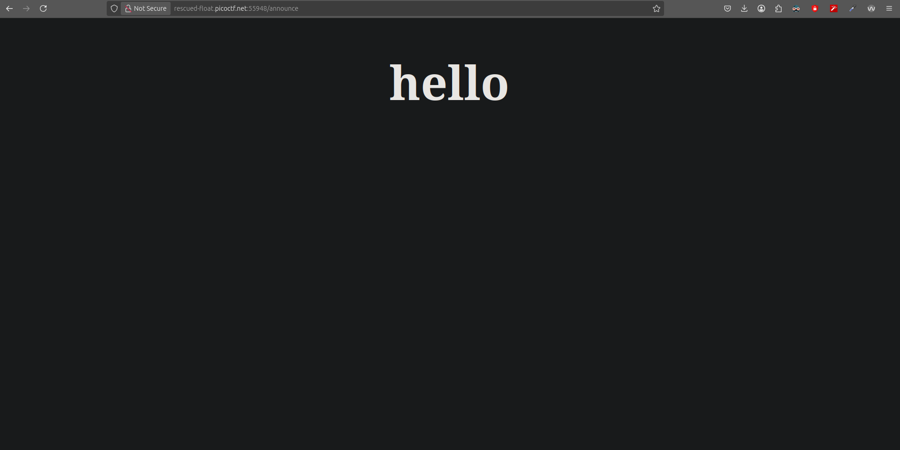
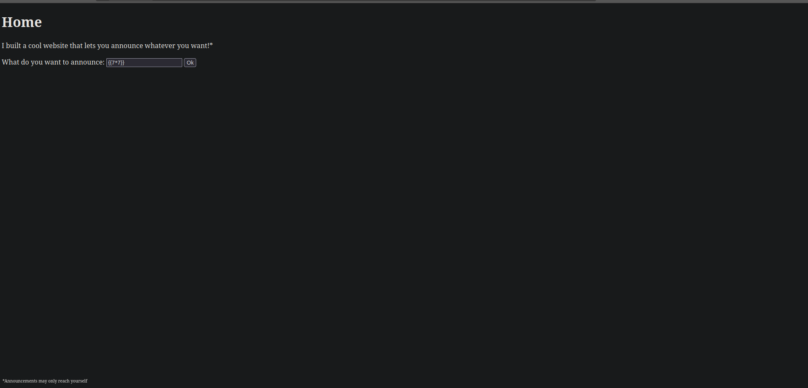
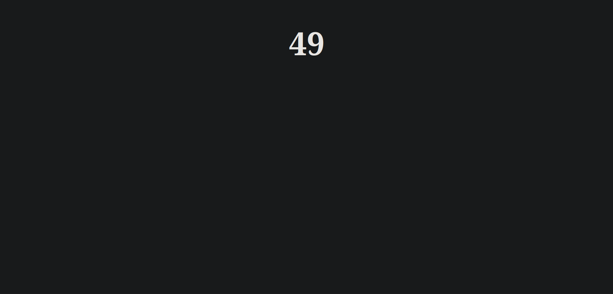
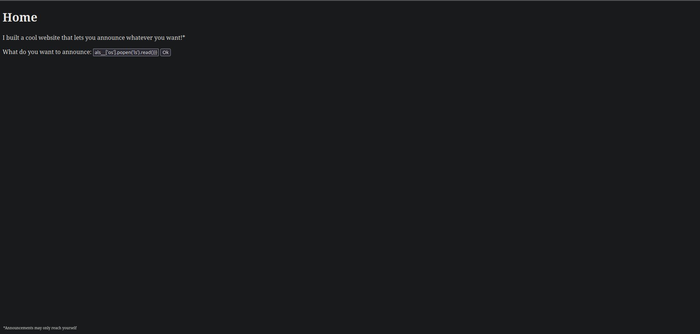
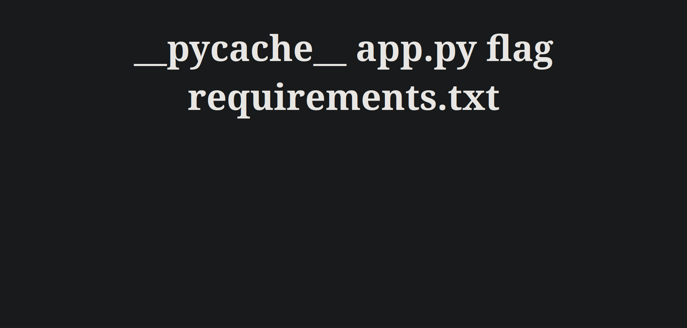
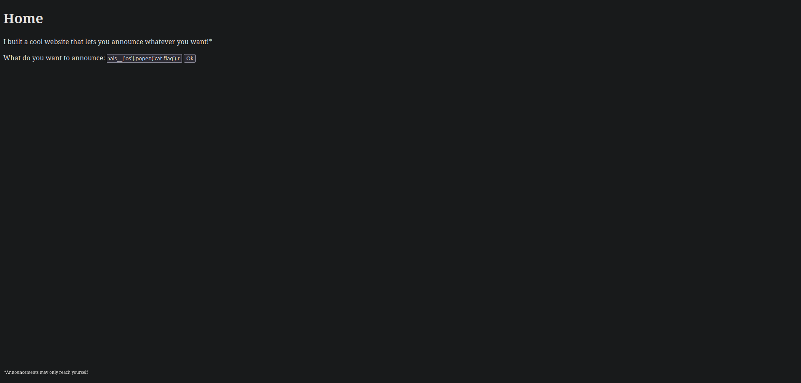
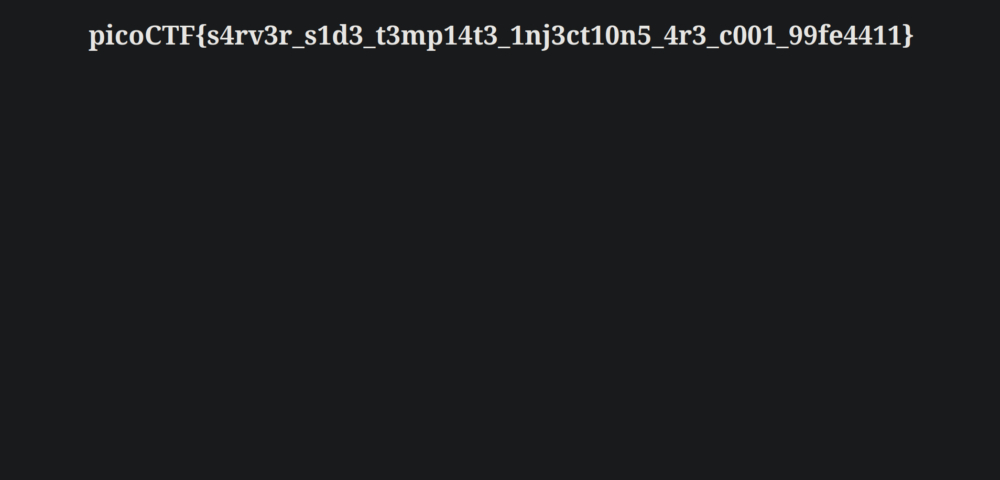

### Challenge: SST1
### Difficulty: Easy
#### Author: deathwish24

The author of this challenge asks us to try out his website. He also mentions that he is using templating on his web app.

Visiting the website, we can see an input where we can type whatever we want:

Let's type something and see what happens after submitting it.

 

So as we can see the `/announce` endpoint literally echoed exactly what we typed.

Now if we pay attention to the name of the challenge `SSTI`, it is an acronym for `Server Side Template Injection`.

That means the website will evaluate and execute whatever we send. 
After searching a bit, I found the [PayloadAllTheThings](https://github.com/swisskyrepo/PayloadsAllTheThings) repository from [Swissky](https://github.com/swisskyrepo) and it is perfect to find an appropriate payload for this challenge.

On the Server Side Template Injection folder, there was a file called ssti.fuzz with a lot of possible payloads. 

So let's test one to see if it works. We will test `{{7 * 7}}`:

 

Indeed the payload worked and the endpoint calculated the result of our input.

Now its time to try something more advanced for example the `ls` command. For that we will use this payload: 

`{{config.__class__.__init__.__globals__['os'].popen('ls').read()}}`

 

The endpoint executed the payload once again and it gave us exactly the output we wanted.

Lastly to solve this challenge we need to slightly modify the previous payload to read the `flag` file. Our modified command will be: `{{config.__class__.__init__.__globals__['os'].popen('cat flag').read()}}`

 

And that was it. The endpoint printed the flag!