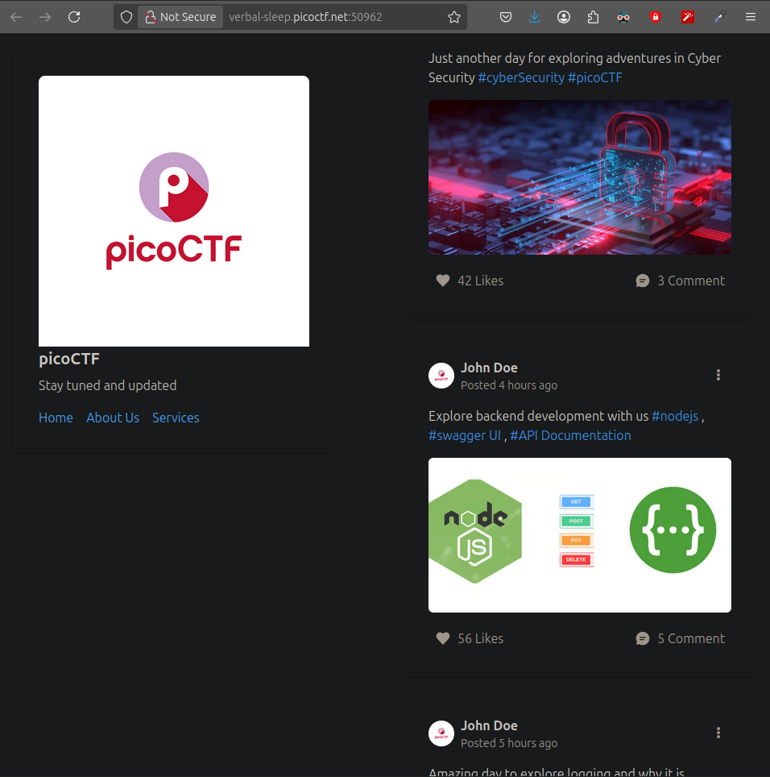
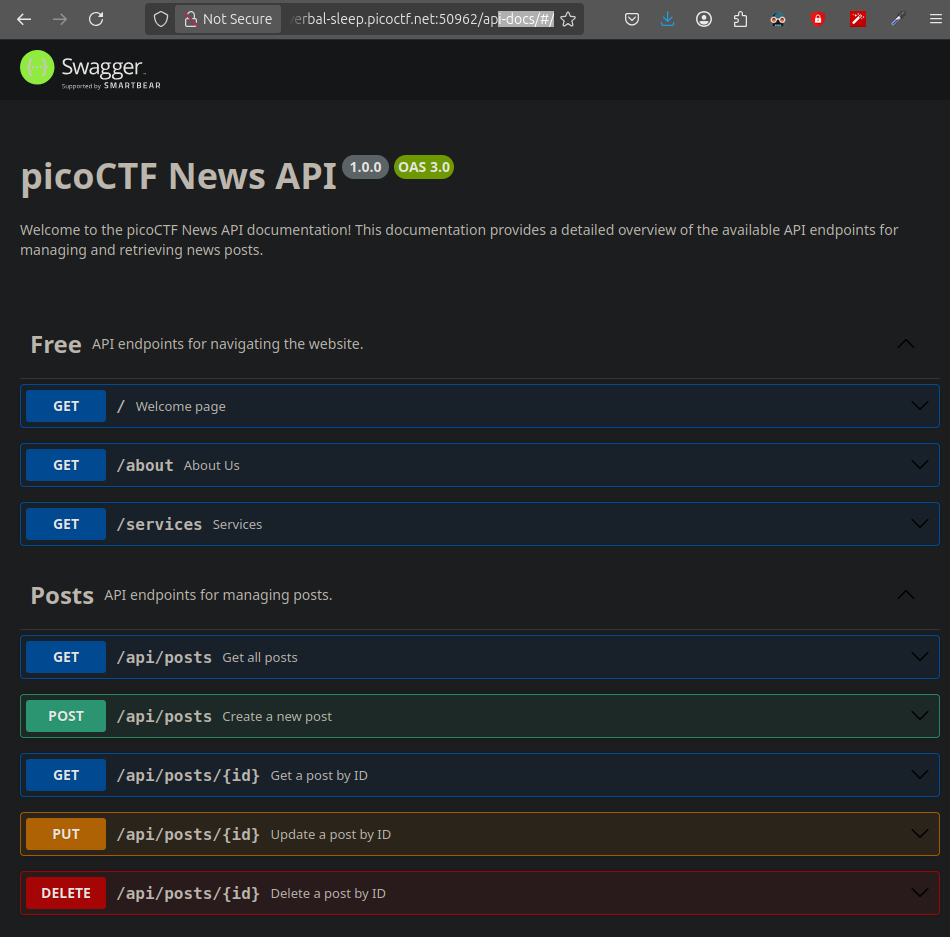
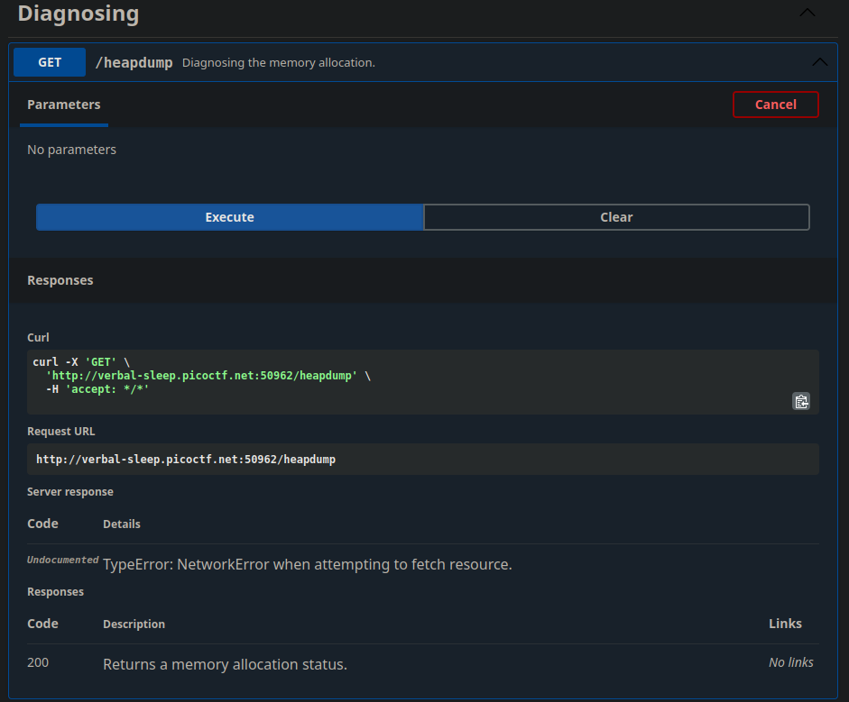

### Challenge: head-dump
### Difficulty: Easy
#### Prepared by: deathwish24

The author of this challenge asks us to explore his web application and find a suspicious endpoint.

At first glance we cant see anything suspicious:

<p align="center">

</p>

We can see though that in the posts the hashtags are blue and that means they are links. Hovering over all of them we can see that the `#API Documentation`, has a valid redirection.

After clicking it we get redirected to the `api-docs` path.

<p align="center">

</p>

Looking around we can see that we can try every command but the one we care about is `headdump`.

So we click `Try it out` and then `Execute`. This will reveal a curl command which we can run on our terminal.

<p align="center">

</p>

Doing so it will give us a very long output which we need to analyze. 

So to be easier we can redirect the curl command's output to a text file.

```console
qwerty@forallsecure:~/Desktop/picoCTF$ curl -X 'GET'   'http://verbal-sleep.picoctf.net:50962/heapdump'   -H 'accept: */*' > headdump.txt
  % Total    % Received % Xferd  Average Speed   Time    Time     Time  Current
                                 Dload  Upload   Total   Spent    Left  Speed
100 8701k  100 8701k    0     0  1254k      0  0:00:06  0:00:06 --:--:-- 1822k
qwerty@forallsecure:~/Desktop/picoCTF$ ls 
headdump.txt
```

Now we just need to find if this file contains anything that contains the pattern `pico` using `grep`.

```console
qwerty@forallsecure:~/Desktop/picoCTF$ grep "pico" headdump.txt 
picoCTF{......._.._..._..._........}
"picoCTF News API",
"Welcome to the picoCTF News API documentation! This documentation provides a detailed overview of the available API endpoints for managing and retrieving news posts.",
"\nwindow.onload = function() {\n  // Build a system\n  var url = window.location.search.match(/url=([^&]+)/);\n  if (url && url.length > 1) {\n    url = decodeURIComponent(url[1]);\n  } else {\n    url = window.location.origin;\n  }\n  var options = {\n  \"swaggerDoc\": {\n    \"openapi\": \"3.0.0\",\n    \"info\": {\n      \"title\": \"picoCTF News API\",\n      \"version\": \"1.0.0\",\n      \"description\": \"Welcome to the picoCTF News API documentation! This documentation provides a detailed overview of the available API endpoints for managing and retrieving news posts.\"\n    },\n    \"paths\": {\n      \"/\": {\n        \"get\": {\n          \"tags\": [\n            \"Free\"\n          ],\n          \"summary\": \"Welcome page\",\n          \"responses\": {\n            \"200\": {\n              \"description\": \"Returns a welcome message.\"\n            }\n          }\n        }\n      },\n      \"/about\": {\n        \"get\": {\n          \"tags\": [\n            \"Free\"\n          ],\n          \"summary\": \"About Us\",\n          \"responses\": {\n            \"200\": {\n              \"desc",
"verbal-sleep.picoctf.net:50551",
```

And that was it. We found the flag!